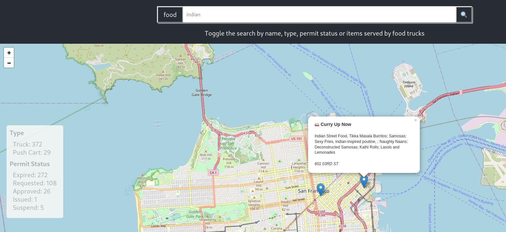

# Food Truck Data

A simple application for searching and understanding food truck data.

This application makes use of the San Francisco city Food Truck data. Each proprietor applies for a permit and the details of that license, their schedule and company information are all part of this data set.

The Food Truck source data was provided in CSV format and a REST API was been created in this project to serve it up. The data is parsed into a meaningful structure and several endpoints were created to query this data (filtering, aggregation, and single proprietor lookup).

A user interface was created to display this data on a map grid of the city, and each proprietor became a marker with an associated tooltip showing all the proprietor's details. A simple search box was then added to allow querying food trucks by one of several meaningful queries (name, type, permit status, and food items).



# Installation

After cloning this code repository, the project dependencies should be installed for both the backend and frontend (UI) project folders.

From the `./food-truck` directory, run the following command:

```sh
npm install
```

Now, navigate to the `./food-truck-ui` directory and issue the same command:

```sh
npm install
```

Now that the project dependencies are installed, the project can be started.

# Launching the Project

The project contains a backend and a frontend application which are started from separate terminal sessions.

In one terminal, start the backend application:

```sh
npm start
```

In another terminal, start the frontend application:

```sh
npm start
```

The latter should auto-launch the frontend application in a web browser, however you can navigate to that URL directly too: http://localhost:3000/

Although the backend application is mainly an API with which the frontend communicates, it too has a UI page where the OpenAPI (aka "Swagger") docs may be viewed: http://localhost:5000/v1/docs

# Future Improvements

There are a few changes which would help make this application "production worthy".

- _Unit, integration and end-to-end testing_ - Manual testing is okay for a quick exercise, but it is vulnerable to regressions when new features are introduced
- _Containerization or serverless_ - The backend API does have a build hook and it could be called in the steps used to create a production container (ie a Dockerfile) or optionally the `app.ts` could be imported into a simple lambda handler file
- _Data persistence_ - Parsing a CSV file and then serving up the data in-memory isn't ideal if the data should ever change and isn't ideal for memory footprint. If this data changes frequently, then a database could be used which is well-suited for frequent writes, and if it will be read frequently then a database well-suited for frequent reads, or if the scope of this data should grow a better relational database engine may be needed.
- _Lighter memory footprint_ - Although NodeJs, Python and other languages do allow for rapid prototyping, they may not be well suited in every situation. The processing speed of NodeJs has improved dramatically over the past 7 years, however its memory footprint can still be quite large. Should memory safety ever become a concern - or multi-threading ever become necessary - there are other options available
- _Front-end caching_ - Over fetching can be prevented on the frontend through caching. This can be implemented in Redux as well as many state management libraries these days. The `react-query` tool being used already in this project also allows for cache configuration, and can be tuned to improve performance.
